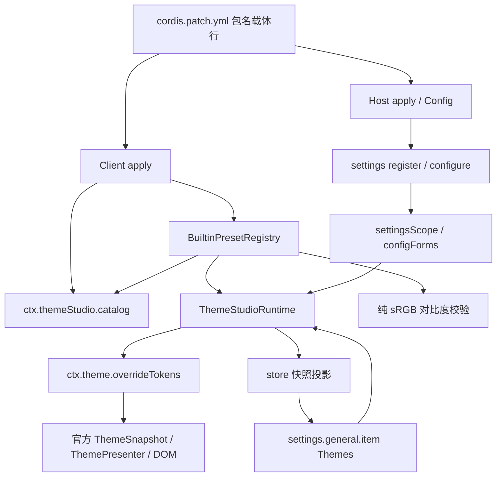

# Theme Studio 架构

## Background

Current，2026-10-02。本架构描述当前源码；历史演进见[提交记录](../reference/repository-history.md)，计划中的 schema 与 Theme Creator Agent 不属于已实现组件。

## Goals and Non-goals

目标是让一个便携插件产生配色覆盖、保存用户选择、提供发现与诊断。官方主题服务继续处理 Appearance、系统模式与 DOM 呈现。这里不设计第二套主题 presenter、不替换官方 settings provider，也不建立跨 Host/Client 的 catalog RPC。

## Current State



## Components

| 模块 | 责任 | 不负责的内容 |
| --- | --- | --- |
| `src/index.ts`、`settings.ts` | Host 注册/Config、导出 schema 与默认值 | UI、浏览器服务、主题呈现 |
| `compat/settings-host.ts` | register/configure 能力探测、volatile 适配、effect 返回值 | 版本字符串驱动分支 |
| `compat/settings-client.ts` | 两种 transport 的最小结构契约 | 独立 RPC 协议 |
| `client/index.ts` | provider、字典、槽位、runtime/store 组装与启停 | durable authority |
| `client/presets.ts`、`chrome-tokens.ts` | 八套明暗配色与派生语义 token | 修改官方 stylesheets |
| `client/catalog.ts` | 防御性复制、冻结、按序发现、报告 | 注册/编辑第三方主题 |
| `client/adapter.ts` | per-scheme map → per-token light/dark 值对 | 对比度认证、公共文件 schema |
| `client/runtime.ts` | active/preview、Host adoption、状态与监听器 | CSS 呈现 |
| `client/store.ts` | 单向同步 runtime snapshot 与静态 cards | 第二持久设置源 |
| `ThemeStudioRow.tsx`、CSS、`locales.ts` | 设置行、操作、装饰色块、可访问性与文案 | 直接操纵 body 主题状态 |
| `contrast.ts`、`contrast-colors.ts` | 规则报告、sRGB 色值解析、混色、alpha 与亮度 | DOM/computed style 审核 |
| `compat/dsh-version.ts`、开发脚本 | 清单、纯分类、安装树静态检查与矩阵 | 生产 Host 的 Node 探测 |

## Interfaces

运行时只依赖 `ThemeOverrideSurface.overrideTokens(source, tokens)`、`ThemeCatalog.get/list` 和 `ThemeSettingsHost.getSnapshot/subscribe/set`。公开服务增加 `ThemeStudioCatalog.validate(id)`；这些最小接口允许用测试替身验证逻辑，也保留官方发布 bundle 的真实集成路径。完整接口见 [runtime](../reference/theme-runtime.md)、[catalog](../reference/theme-catalog.md)、[settings](../reference/settings-and-package-contract.md)。

## Data Flow

### 从配色到呈现

内置 Palette 含 13 个人工字段。`tokens()` 将其映射为基本 token 并与 `deriveChrome()` 合并，随后 preset 工厂冻结配色与 preview。catalog 构造时再做防御性复制，确保传入列表后续变更不影响 runtime。adapter 确认两种模式 token 键相同且值为字符串，转成 `ThemeTokenOverrides`。

```text
Official Light / Dark / System
        ↓
ACTIVE_SOURCE  (@dsh-electron/dsh-theme-studio:active)
        ↓
PREVIEW_SOURCE (@dsh-electron/dsh-theme-studio:preview)
        ↓
ThemeSnapshot → ThemePresenter → DOM
```

官方服务按 overlay seq 决定同 token 的最后覆盖层。替换相同 source 后，旧 disposer 不能删除新层。插件依赖这一正式契约，不能把 old-disposer 的清理改成无条件 source 删除。

### 从 UI 到持久设置

Client 创建 store，runtime 变化后通过订阅调用 bound actions 的 `sync`。槽位注入组件时绑定 actions 并立即同步当前快照。按钮调用 runtime facade；Apply 乐观更新 active 层并异步调用 Host.set。accepted Host snapshot 不同于本地选择时重新 adoption。persistGeneration 防止旧写入 settlement 在后续动作或 dispose 后重新驱动本地状态。

### catalog 与校验

Client `apply` 首先创建唯一 catalog，调用 `ctx.provide('themeStudio', Object.freeze({ catalog }))`。设置通道 child 启动的 runtime 使用同一实例。`validate` 每次按当前冻结 preset 计算新报告，报告和 checks 都不可变；没有变化流或缓存失效协议。校验既不写设置也不安装 overlay。

## Lifecycle

| 时机 | provider | runtime/UI |
| --- | --- | --- |
| Client 必需服务满足，apply 运行 | 立即提供 catalog | 等待实际 settingsScope 或 configForms |
| 设置 child 初次启动 | 同一 provider | 启动 runtime、注册字典、监听、槽位 |
| Host snapshot loading | 可发现 | 显示读取状态，不凭未就绪值替换 durable 状态 |
| 设置 child 停止 | 保持 | effect 释放 overlays、字典、槽位、监听；清 startOnce guard |
| 设置重供/切换另一 transport | 保持同一 catalog | 新 child 可再次启动 |
| Client 插件卸载 | Cordis 撤销，消费者停止 | 所有 child 随 fiber 释放 |
| Client 插件重载 | 新 catalog，新 provider | 从 Host accepted snapshot 恢复，消费者重新运行 |

两个 transport callback 必须保持不同函数身份，Cordis 以 callback 身份作为注入 plugin runtime 的 key。startOnce 只由成功拥有启动的 child 释放；不能让没有启动的 child 清空 guard。

## Error Handling

未知持久 id 会移除两层、恢复默认、发起设置修复；未知显式 activate/preview id 抛错。adapter 拒绝不完整键对与非字符串。disposed runtime 的写方法抛错，dispose 幂等。对比度不支持的语法返回 unknown、保留 reason，不能因解析失败跳过该 check。重复 catalog id 在构造时抛错。

设置 rejected Promise 的用户呈现目前未单独实现；renderer/style 载入错误仍由宿主报错。构建 helper 注入的静态 CSS 标签幂等保留，不应把 runtime 的 overlay 清理描述成所有 CSS 标签也被卸载。排查见 [troubleshooting](../troubleshooting/README.md)。

## Compatibility

Host 通过公开 settings 方法探测结构；Client 分别 inject transport，避免读取 proxy 未注入服务。官方 loader 从 bare package row 扫描 `dsh.client` metadata。Headless 只加载 Host，Client catalog 不存在。所有依赖通过 registry semver/精确 peer 范围表达；tsconfig 自包含。详细版本证据以[矩阵](../development/dsh-compatibility.md)为准。

## Alternatives and Decisions

选择原因分别记录在 [ADR 目录](../decisions/README.md)：overlay 替代 CSS presenter、双 settings transport 替代单一新版 API、官方包注册替代自定义插件页、派生 chrome 替代只有 13 个 token、诊断报告替代自动改色、readonly catalog 替代第三方动态注册。

## Risks and Validation

语义 token 名与实际 host 使用场景可能随上游变化；公开 token 对比度报告不能推导真实 DOM 的完整符合性。`color-mix(in srgb)` 和 resolver 的支持子集必须同时更新。store 与 service 必须继续共享 catalog。全部相关 seam 已纳入测试与十版矩阵；平台/视觉/真实磁盘旅程的未覆盖范围不可消失。验收文件、日期和历史提交见[需求](../requirements/theme-studio.md)与 completed 计划。
